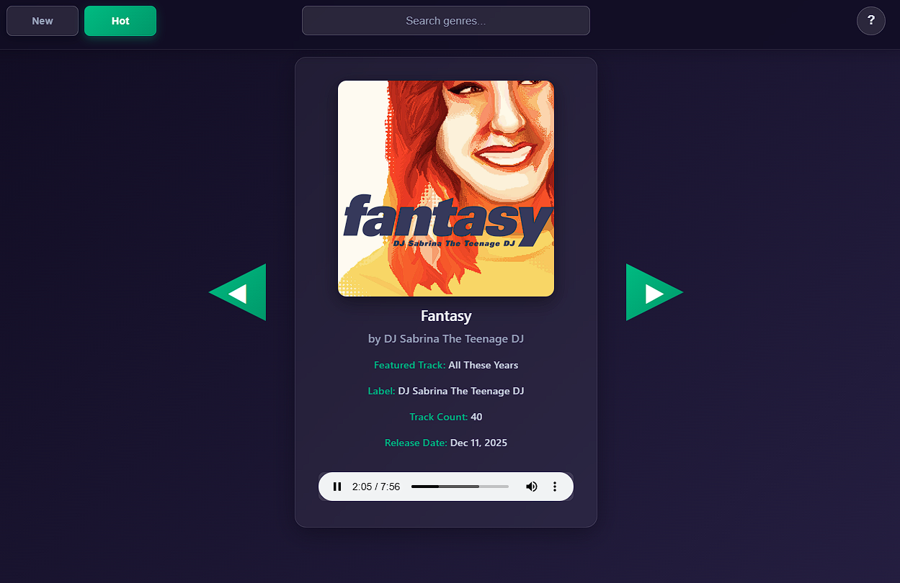

# Bandcamp Discovery Player

A modern web application for discovering and streaming music from Bandcamp with enhanced listening controls and quick navigation. Built for music enthusiasts who want to efficiently explore new artists and tracks.



## What This App Does

This app addresses the limitations of Bandcamp's native discovery page by providing:

- **Quick Track Listening**: Listen to featured tracks immediately without navigating away
- **Volume Controls**: Adjustable volume settings for better listening experience
- **Rapid Navigation**: Keyboard shortcuts for fast browsing between artists
- **Easy Link Sharing**: One-click copying of album links when you find something you like
- **Streamlined Workflow**: Skip tracks you don't like and move to the next artist instantly
- **Dual Mode Discovery**: Switch between "New Releases" and "Hot" (best selling) breakcore albums

## Why This Exists

Bandcamp's discovery page is great for finding new music, but their featured track controls are limited. This app provides a more efficient way to:

- Preview tracks quickly
- Navigate between artists seamlessly
- Copy album links when you discover something you enjoy
- Control volume and playback settings

## Keyboard Shortcuts

- **Q**: Previous album
- **E**: Next album
- **W**: Copy album link to clipboard
- **S**: Open album page in new tab
- **Space**: Play/pause current track
- **←**: Seek backward 10 seconds
- **→**: Seek forward 10 seconds
- **↑**: Increase volume
- **↓**: Decrease volume
- **/**: Focus genre search
- **Escape**: Close help modal

## Project Structure

```
bandcamp-scraper/
├── src/
│   ├── server/
│   │   ├── app.js              # Main Express app configuration
│   │   ├── index.js            # Server entry point
│   │   ├── routes/
│   │   │   └── albums.js       # Album API routes
│   │   └── middleware/
│   │       └── static.js       # Static file serving middleware
├── public/
│   ├── index.html              # Main HTML file
│   ├── index.css               # Styles
│   ├── js/
│   │   ├── api.js              # API service
│   │   ├── state.js            # App state management
│   │   └── app.js              # Client-side app
|   |   └── genres.js           # Predefined genre list
├── package.json
└── README.md
└── vercel.json             
```

## Getting Started

### Prerequisites

- Node.js (v14 or higher)
- npm or yarn

### Installation

1. Clone the repository:

```bash
git clone <repository-url>
cd bandcamp-scraper
```

2. Install dependencies:

```bash
npm install
```

3. Start the development server:

```bash
npm run dev
```

4. Open your browser and navigate to `http://localhost:3000`

### Available Scripts

- `npm start`: Start the production server
- `npm run dev`: Start the development server with auto-reload
- `npm run lint`: Run ESLint for code quality checks
- `npm run format`: Format code with Prettier

## API Endpoints

- `GET /api/albums?page=1`: Fetch albums with pagination
- `GET /health`: Health check endpoint

## Performance Optimizations

- **Image Preloading**: Next 3 album covers are preloaded
- **Caching**: Static assets cached for 24 hours
- **Pagination**: Efficient cursor-based pagination
- **Duplicate Prevention**: Prevents duplicate albums using link tracking

## Browser Support

- Chrome/Chromium (recommended)
- Firefox
- Safari
- Edge

## Contributing

1. Fork the repository
2. Create a feature branch
3. Make your changes
4. Run tests and linting
5. Submit a pull request

## License

MIT License - see LICENSE file for details
