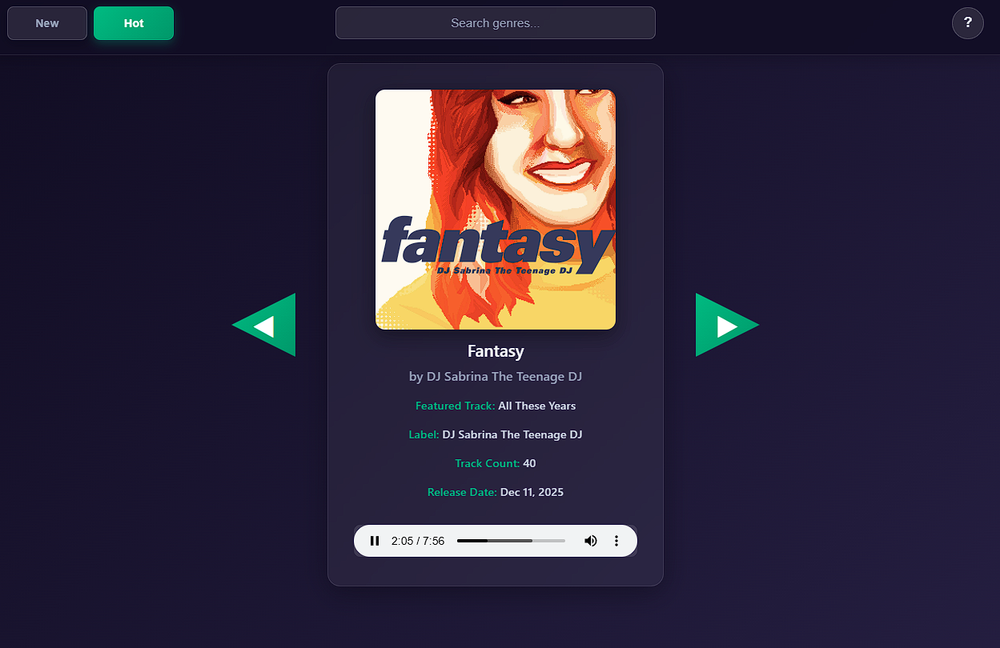

# Bandcamp Discovery Player

A modern web application for discovering and streaming music from Bandcamp with enhanced listening controls and quick navigation. Built for music enthusiasts who want to efficiently explore new artists and tracks.



## What This App Does

This app addresses the limitations of Bandcamp's native discovery page by providing:

- **Quick Track Listening**: Listen to featured tracks immediately without navigating away
- **Volume Controls**: Adjustable volume settings for better listening experience
- **Rapid Navigation**: Keyboard shortcuts for fast browsing between artists
- **Easy Link Sharing**: One-click copying of album links when you find something you like
- **Streamlined Workflow**: Skip tracks you don't like and move to the next artist instantly
- **Dual Mode Discovery**: Switch between "New Releases" and "Hot" (best selling) breakcore albums

## Why This Exists

Bandcamp's discovery page is great for finding new music, but their featured track controls are limited. This app provides a more efficient way to:

- Preview tracks quickly
- Navigate between artists seamlessly
- Copy album links when you discover something you enjoy
- Control volume and playback settings

## Keyboard Shortcuts

- **Q**: Previous album
- **E**: Next album
- **W**: Copy album link to clipboard
- **S**: Open album page in new tab
- **Space**: Play/pause current track
- **←**: Seek backward 10 seconds
- **→**: Seek forward 10 seconds
- **↑**: Increase volume
- **↓**: Decrease volume
- **/**: Focus genre search
- **Escape**: Close help modal

## Project Structure

```
bandcamp-discovery-player/
├── api/
│   └── index.ts                # Vercel serverless entry point
├── public/                     # Frontend static assets
│   ├── index.html              # Main HTML entry point
│   ├── css/                    # Stylesheets
│   └── js/                     # Frontend TypeScript modules
│       ├── app.ts              # Main frontend controller
│       ├── api.ts              # API client
│       ├── state.ts            # Application state management
│       ├── genres.ts           # Genre data and validation
│       └── ui/                 # UI components and builders
├── src/                        # Backend and shared code
│   ├── server/                 # Express server
│   │   ├── app.ts              # Express app configuration
│   │   ├── index.ts            # Server entry point
│   │   ├── config.ts           # Server configuration/constants
│   │   ├── routes/             # API route handlers
│   │   └── middleware/         # Custom middleware
│   └── shared/                 # Shared TypeScript types
├── tests/                      # Test suites
│   ├── unit/                   # Vitest unit tests
│   └── e2e/                    # Playwright end-to-end tests
├── dist/                       # Compiled production code (gitignored)
├── vite.config.ts              # Vite configuration
├── vitest.config.ts            # Vitest configuration
├── playwright.config.ts        # Playwright configuration
├── tsconfig.json               # TypeScript configuration
├── eslint.config.js            # ESLint configuration
└── README.md
```

## Getting Started

### Prerequisites

- Node.js (v18 or higher)
- npm or yarn

### Installation

1. Clone the repository:
   ```bash
   git clone <repository-url>
   cd bandcamp-discovery-player
   ```

2. Install dependencies:
   ```bash
   npm install
   ```

3. Build the project:
   ```bash
   npm run build
   ```

4. Start the development server (Concurrent Mode):
   ```bash
   npm run dev
   ```

5. Open your browser and navigate to `http://localhost:3000`

### Available Scripts

- `npm run dev`: Start both backend and frontend development servers concurrently
- `npm run build`: Compile TypeScript and build the frontend bundle
- `npm start`: Start the production server using compiled code
- `npm run test:unit`: Run Vitest unit tests
- `npm run test:e2e`: Run Playwright end-to-end tests
- `npm run test:coverage`: Run unit tests with coverage reporting
- `npm run lint`: Run ESLint checks
- `npm run format`: Format code with Prettier

## API Endpoints

- `GET /api/albums`: Fetch albums from Bandcamp
  - **Query Params**:
    - `page` (number): Pagination page (default: 1)
    - `slice` ("new" | "hot"): Filter by new or hot releases (default: "new")
    - `tag` (string): Genre tag to filter by (default: "breakcore")
- `GET /health`: Health check endpoint

## Performance Optimizations

- **Image Preloading**: Next 3 album covers are preloaded
- **Caching**: Static assets cached for 24 hours
- **Pagination**: Efficient cursor-based pagination
- **Duplicate Prevention**: Prevents duplicate albums using link tracking

## Browser Support

- Chrome/Chromium (recommended)
- Firefox
- Safari
- Edge

## Contributing

1. Fork the repository
2. Create a feature branch
3. Make your changes
4. Run tests and linting
5. Submit a pull request

## License

MIT License - see LICENSE file for details
