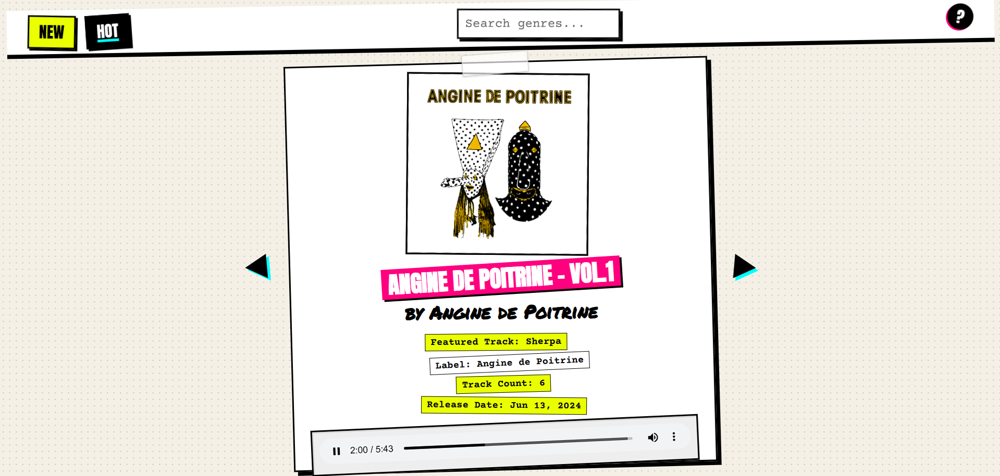
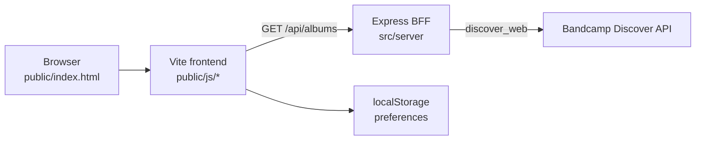
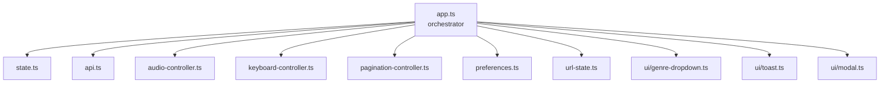

# Bandcamp Discovery Player

A modern web application for discovering and streaming music from Bandcamp with enhanced listening controls and quick navigation. Built for music enthusiasts who want to efficiently explore new artists and tracks.

**Version:** 1.1.0



## What This App Does

This app addresses the limitations of Bandcamp's native discovery page by providing:

- **Quick Track Listening**: Listen to featured tracks immediately without navigating away
- **Volume Controls**: Adjustable volume settings for better listening experience
- **Rapid Navigation**: Keyboard shortcuts for fast browsing between artists
- **Easy Link Sharing**: One-click copying of album links when you find something you like
- **Streamlined Workflow**: Skip tracks you don't like and move to the next artist instantly
- **Dual Mode Discovery**: Switch between "New Releases" and "Hot" (best selling) albums
- **Persistent Preferences**: Volume, last slice (`new`/`hot`), and last genre restore from `localStorage`
- **Error Recovery**: Retry failed album loads without a page refresh; auto-skip unplayable tracks

## Why This Exists

Bandcamp's discovery page is great for finding new music, but their featured track controls are limited. This app provides a more efficient way to:

- Preview tracks quickly
- Navigate between artists seamlessly
- Copy album links when you discover something you enjoy
- Control volume and playback settings

## Keyboard Shortcuts

- **Q**: Previous album
- **E**: Next album
- **W**: Copy album link to clipboard
- **S**: Open album page in new tab
- **Space**: Play/pause current track
- **←**: Seek backward 10 seconds
- **→**: Seek forward 10 seconds
- **↑**: Increase volume
- **↓**: Decrease volume
- **/**: Focus genre search
- **Escape**: Close help modal

## Architecture

The app is a Vite frontend plus an Express BFF. The browser never talks to Bandcamp directly; `GET /api/albums` proxies Bandcamp Discover, then the player modules handle playback, paging, and UI.


```mermaid
flowchart LR
Browser["Browser<br/>public/index.html"]
Vite["Vite frontend<br/>public/js/*"]
Express["Express BFF<br/>src/server"]
Bandcamp["Bandcamp Discover API"]
Store["localStorage<br/>preferences"]

Browser --> Vite
Vite -->|"GET /api/albums"| Express
Express -->|"discover_web"| Bandcamp
Vite --> Store
```


```mermaid
flowchart TB
App["app.ts<br/>orchestrator"]
State["state.ts"]
API["api.ts"]
Audio["audio-controller.ts"]
Keys["keyboard-controller.ts"]
Pages["pagination-controller.ts"]
Prefs["preferences.ts"]
URL["url-state.ts"]
Genre["ui/genre-dropdown.ts"]
Toast["ui/toast.ts"]
Modal["ui/modal.ts"]

App --> State
App --> API
App --> Audio
App --> Keys
App --> Pages
App --> Prefs
App --> URL
App --> Genre
App --> Toast
App --> Modal
```

**Request path**

1. The UI asks `api.ts` for a page of albums (`page`, `slice`, `tag`).
2. Express validates the query, fetches Bandcamp, and returns a normalized album list.
3. `app.ts` stores the page in `state.ts`, renders the current album, and `audio-controller.ts` loads the featured track.
4. Keyboard, genre search, and pagination controllers update state and URL params without a full reload.
5. Volume, slice, and genre are written to `localStorage` via `preferences.ts`.

## Project Structure

```
bandcamp-discovery-player/
├── api/
│   └── index.ts                # Vercel serverless entry point
├── public/                     # Frontend static assets
│   ├── index.html              # Main HTML entry point
│   ├── css/                    # Stylesheets
│   └── js/                     # Frontend TypeScript modules
│       ├── app.ts              # Main frontend controller
│       ├── api.ts              # API client
│       ├── state.ts            # Application state management
│       ├── genres.ts           # Genre data and validation
│       └── ui/                 # UI components and builders
├── src/                        # Backend and shared code
│   ├── server/                 # Express server
│   │   ├── app.ts              # Express app configuration
│   │   ├── index.ts            # Server entry point
│   │   ├── config.ts           # Server configuration/constants
│   │   ├── routes/             # API route handlers
│   │   └── middleware/         # Custom middleware
│   └── shared/                 # Shared TypeScript types
├── tests/                      # Test suites
│   ├── unit/                   # Vitest unit tests
│   └── e2e/                    # Playwright end-to-end tests
├── dist/                       # Compiled production code (gitignored)
├── vite.config.ts              # Vite configuration
├── vitest.config.ts            # Vitest configuration
├── playwright.config.ts        # Playwright configuration
├── tsconfig.json               # TypeScript configuration
├── eslint.config.js            # ESLint configuration
└── README.md
```

## Getting Started

### Prerequisites

- Node.js 18 or higher (CI runs **20.19.0**)
- npm

No `.env` file is required for local development. See [Environment variables](#environment-variables).

### Installation

1. Clone the repository:

```bash
git clone <repository-url>
cd bandcamp-discovery-player
```

2. Install dependencies:

```bash
npm install
```

3. Build the project:

```bash
npm run build
```

4. Start the development server (concurrent backend + Vite):

```bash
npm run dev
```

5. Open your browser and navigate to `http://localhost:3000`

### Available Scripts

- `npm run dev`: Start both backend and frontend development servers concurrently
- `npm run build`: Compile TypeScript and build the frontend bundle
- `npm start`: Start the production server using compiled code
- `npm run test:unit`: Run Vitest unit tests
- `npm run test:e2e`: Run Playwright end-to-end tests
- `npm run test:coverage`: Run unit tests with coverage reporting
- `npm run lint`: Run ESLint checks (`src/`)
- `npm run format`: Format `src/` and `public/` with Prettier

## Environment variables

The Bandcamp Discover URL is a constant in `src/server/config.ts`. There is no API key and no required secrets.

| Variable   | Required | Default | Used by                                  | Purpose                                                                  |
| ---------- | -------- | ------- | ---------------------------------------- | ------------------------------------------------------------------------ |
| `PORT`     | No       | `3000`  | `src/server/config.ts`                   | HTTP listen port for the Express server                                  |
| `NODE_ENV` | No       | unset   | `src/server/middleware/error-handler.ts` | When `development`, 500 responses include the error message as `details` |
| `VERCEL`   | No       | unset   | `src/server/middleware/static.ts`        | Set automatically on Vercel; switches the static-file root               |
| `CI`       | No       | unset   | `playwright.config.ts`                   | Set automatically in GitHub Actions; disables reusing a local dev server |

Example:

```bash
PORT=4000 NODE_ENV=development npm run dev
```

## API Endpoints

- `GET /api/albums`: Fetch albums from Bandcamp
- **Query Params**:
- `page` (number): Pagination page (default: 1)
- `slice` ("new" | "hot"): Filter by new or hot releases (default: "new")
- `tag` (string): Genre tag to filter
- `GET /health`: Health check endpoint

## CI pipeline

GitHub Actions workflows live in `.github/workflows/`.

### `ci.yml` — Lint, Typecheck, Unit, Build and E2E

Runs on every push to `main` and on every pull request.

1. Checkout
2. Node.js **20.19.0** with npm cache
3. Install: `npm ci`, falling back to `npm install --no-audit --prefer-offline` if the lockfile cannot be satisfied on the runner
4. `npm run lint`
5. `tsc --noEmit`
6. `npm run test:unit`
7. `npm run build`
8. `npx playwright install --with-deps`
9. `npm run test:e2e` with `CI=true`

A failing step stops the job. The PR cannot be considered green until this workflow passes.

### `dependency-audit.yml` — weekly npm audit

Runs every Sunday at 00:00 UTC and on manual `workflow_dispatch`. It runs `npm audit`, uploads `audit.json` as an artifact, and opens a GitHub issue when any vulnerabilities are reported.

## Performance Optimizations

- **Image Preloading**: Next 3 album covers are preloaded
- **Caching**: Static assets cached for 24 hours
- **Pagination**: Efficient cursor-based pagination
- **Duplicate Prevention**: Prevents duplicate albums using link tracking

## Browser Support

- Chrome/Chromium (recommended)
- Firefox
- Safari
- Edge

## Contributing

1. Fork the repository
2. Create a feature branch from `main`
3. Make your changes
4. Run the same checks CI runs (see below)
5. Open a pull request against `main`

### Code style

These conventions match `eslint.config.js` and Prettier:

- TypeScript throughout `src/` and `public/js/`
- Strict equality only (`===` / `!==`); `eqeqeq` is an ESLint error
- No `any`; use `unknown` and narrow
- `const` over `let`; never `var`
- Object shorthand and template literals
- No duplicate imports
- Unused variables are errors (`@typescript-eslint/no-unused-vars`)
- `console.*` is a warning (the Express error handler is an allowed exception)
- Format with Prettier (`npm run format`) before opening a PR

Keep frontend modules focused: playback in `audio-controller.ts`, genre matching in `ui/genre-dropdown.ts`, persistence in `preferences.ts`. Do not reintroduce a monolithic `app.ts`.

### Local checks before a PR

```bash
npm run lint
npx tsc --noEmit
npm run test:unit
npm run build
npm run test:e2e
```

Install Playwright browsers once with `npx playwright install`.

Prefer a regression test with the change: Vitest for matching, state, and controllers; Playwright for visible player, keyboard, and error-recovery behavior.

## Versioning

The app version lives in `package.json` (and `package-lock.json`).

| Version | Notes                                                                                                                                                                                                                                                                                                                                      |
| ------- | ------------------------------------------------------------------------------------------------------------------------------------------------------------------------------------------------------------------------------------------------------------------------------------------------------------------------------------------ |
| `1.0.0` | TypeScript migration                                                                                                                                                                                                                                                                                                                       |
| `1.0.1` | Versioning / verbiage fix ([PR #18](https://github.com/aonuferco/bandcamp-discovery-player/pull/18))                                                                                                                                                                                                                                       |
| `1.1.0` | First minor since `1.0.1`. **52 merged PRs** (#19–#72, skipping unpublished #66 and #68): genre backgrounds, mobile UI, security hardening, error handling, TypeScript strictness, frontend modularity, performance, WCAG 2.1 AA, CI, persistent preferences, custom transport + volume, fuzzy genre search, and playback error recovery |

Semver used here: **minor** for backwards-compatible features; **patch** for fixes-only releases. This bump is a minor because the post-`1.0.1` work adds user-facing capabilities rather than a breaking API change.

## License

MIT License - see LICENSE file for details
