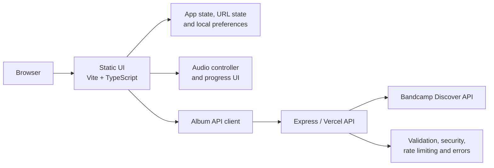

# Bandcamp Discovery Player

A modern web application for discovering and streaming music from Bandcamp with enhanced listening controls and quick navigation. Built for music enthusiasts who want to efficiently explore new artists and tracks.


## What This App Does

This app addresses the limitations of Bandcamp's native discovery page by providing:

- **Quick Track Listening**: Listen to featured tracks immediately without navigating away
- **Volume Controls**: Adjustable volume settings for better listening experience
- **Rapid Navigation**: Keyboard shortcuts for fast browsing between artists
- **Easy Link Sharing**: One-click copying of album links when you find something you like
- **Streamlined Workflow**: Skip tracks you don't like and move to the next artist instantly
- **Dual Mode Discovery**: Switch between "New Releases" and "Hot" (best selling) albums

## Why This Exists

Bandcamp's discovery page is great for finding new music, but their featured track controls are limited. This app provides a more efficient way to:

- Preview tracks quickly
- Navigate between artists seamlessly
- Copy album links when you discover something you enjoy
- Control volume and playback settings

## Keyboard Shortcuts

- **Q**: Previous album
- **E**: Next album
- **W**: Copy album link to clipboard
- **S**: Open album page in new tab
- **Space**: Play/pause current track
- **←**: Seek backward 10 seconds
- **→**: Seek forward 10 seconds
- **↑**: Increase volume
- **↓**: Decrease volume
- **/**: Focus genre search
- **Escape**: Close help modal

## Project Structure

```
bandcamp-discovery-player/
├── api/
│   └── index.ts                # Vercel serverless entry point
├── public/                     # Frontend static assets
│   ├── index.html              # Main HTML entry point
│   ├── index.css               # Frontend styles
│   └── js/                     # Frontend TypeScript modules
│       ├── app.ts              # Main frontend controller
│       ├── api.ts              # API client
│       ├── state.ts            # Application state management
│       ├── genres.ts           # Genre data and validation
│       └── ui/                 # UI components and builders
├── src/                        # Backend and shared code
│   ├── server/                 # Express server
│   │   ├── app.ts              # Express app configuration
│   │   ├── index.ts            # Server entry point
│   │   ├── config.ts           # Server configuration/constants
│   │   ├── routes/             # API route handlers
│   │   └── middleware/         # Custom middleware
│   └── shared/                 # Shared TypeScript types
├── tests/                      # Test suites
│   ├── unit/                   # Vitest unit tests
│   └── e2e/                    # Playwright end-to-end tests
├── dist/                       # Compiled production code (gitignored)
├── vite.config.ts              # Vite configuration
├── vitest.config.ts            # Vitest configuration
├── playwright.config.ts        # Playwright configuration
├── tsconfig.json               # TypeScript configuration
├── eslint.config.js            # ESLint configuration
└── README.md
```

## Architecture


```mermaid
flowchart LR
    User[Browser] --> UI[Static UI<br/>Vite + TypeScript]
    UI --> State[App state, URL state<br/>and local preferences]
    UI --> Player[Audio controller<br/>and progress UI]
    UI --> APIClient[Album API client]
    APIClient --> Server[Express / Vercel API]
    Server --> Bandcamp[Bandcamp Discover API]
    Server --> Middleware[Validation, security,<br/>rate limiting and errors]
```

The frontend is a small set of framework-free TypeScript modules. `app.ts`
coordinates state, UI managers, pagination, keyboard controls, preferences, and
audio playback. The Express backend validates album requests and translates
Bandcamp's response into the shared `Album` model. The same Express app runs
locally and through the Vercel serverless entry point.

## Getting Started

### Prerequisites

- Node.js (v18 or higher)
- npm or yarn

### Installation

1. Clone the repository:

   ```bash
   git clone <repository-url>
   cd bandcamp-discovery-player
   ```

2. Install dependencies:

   ```bash
   npm install
   ```

3. Build the project:

   ```bash
   npm run build
   ```

4. Start the development server (Concurrent Mode):

   ```bash
   npm run dev
   ```

5. Open the Vite frontend at `http://localhost:5173`. The API runs at
   `http://localhost:3000` and is proxied by Vite during development.

### Available Scripts

- `npm run dev`: Start both backend and frontend development servers concurrently
- `npm run build`: Compile TypeScript and build the frontend bundle
- `npm start`: Start the production server using compiled code
- `npm run test:unit`: Run Vitest unit tests
- `npm run test:e2e`: Run Playwright end-to-end tests
- `npm run test:coverage`: Run unit tests with coverage reporting
- `npm run lint`: Run ESLint checks
- `npm run format`: Format code with Prettier

## Environment Variables

No environment variables are required for local development.

| Variable   | Required | Default       | Purpose                                                           |
| ---------- | -------- | ------------- | ----------------------------------------------------------------- |
| `PORT`     | No       | `3000`        | Port used by the Express API server                               |
| `NODE_ENV` | No       | `development` | Controls whether server errors include development details        |
| `VERCEL`   | No       | unset         | Selects Vercel's serverless static-asset path when deployed       |
| `CI`       | No       | unset         | Makes Playwright start a fresh test server; set by GitHub Actions |

The Bandcamp API endpoint, request headers, and timeout are currently defined
as constants in `src/server/config.ts`.

## API Endpoints

- `GET /api/albums`: Fetch albums from Bandcamp
  - **Query Params**:
    - `page` (number): Pagination page (default: 1)
    - `slice` ("new" | "hot"): Filter by new or hot releases (default: "new")
    - `tag` (string): Genre tag to filter
- `GET /health`: Health check endpoint

## Performance Optimizations

- **Image Preloading**: Next 3 album covers are preloaded
- **Caching**: Static assets cached for 24 hours
- **Pagination**: Efficient cursor-based pagination
- **Duplicate Prevention**: Prevents duplicate albums using link tracking

## Browser Support

- Chrome/Chromium (recommended)
- Firefox
- Safari
- Edge

## Continuous Integration

GitHub Actions runs `.github/workflows/ci.yml` for pull requests and pushes to
`main`. The pipeline:

1. Uses Node.js 20.19.
2. Installs dependencies from `package-lock.json`.
3. Runs ESLint.
4. Runs TypeScript type checking.
5. Runs the Vitest unit suite.
6. Builds the backend and Vite frontend.
7. Installs Playwright's browser and system dependencies.
8. Runs the Playwright end-to-end and accessibility suites.

`.github/workflows/dependency-audit.yml` also performs the scheduled dependency
security audit. Run the same primary checks locally before opening a pull
request:

```bash
npm run lint
npx tsc --noEmit
npm run test:unit
npm run build
npm run test:e2e
```

## Contributing

1. Fork the repository
2. Create a focused feature branch from `main`
3. Install dependencies with `npm ci`
4. Make your changes and add or update tests
5. Run lint, type checking, unit tests, build, and relevant E2E tests
6. Format changed files with Prettier
7. Submit a pull request describing the behavior change and test coverage

### Code Style

- Use TypeScript with explicit public interfaces and avoid `any`.
- Prefer `const`, strict equality, and immutable updates.
- Keep DOM construction and event handling in focused UI/controller modules;
  keep `app.ts` limited to orchestration.
- Use shared types from `src/shared/types.ts`.
- Treat user-provided and remote values as untrusted and validate them before
  using them in URLs, API requests, or the DOM.
- Preserve keyboard and screen-reader support for all interactive features.
- Use Prettier for formatting and follow the ESLint configuration.
- Include unit coverage for pure logic and Playwright coverage for user-facing
  workflows.

## License

MIT License - see LICENSE file for details
